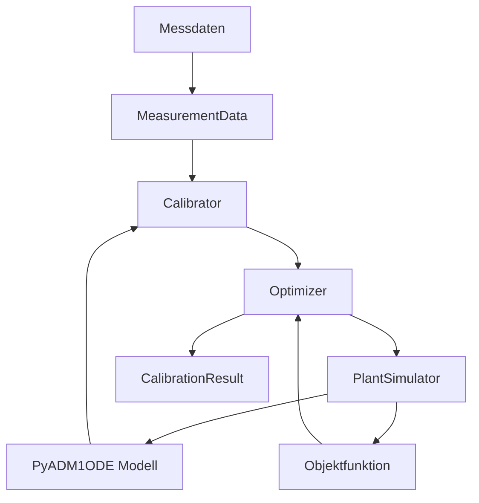

# Architektur

PyADM1ODE_calibration ist modular aufgebaut, um Flexibilität bei der Wahl von Algorithmen und Datenquellen zu gewährleisten.

## Systemübersicht

Die folgende Diagramm zeigt die Interaktion zwischen den Hauptkomponenten:

## Datenfluss

1. **Input**: Messdaten werden über `io.loaders` eingelesen.
2. **Validierung**: `io.validation` prüft die Datenqualität.
3. **Optimierung**: Der `Calibrator` orchestriert den `Optimizer`, um Parameter zu finden, die den Fehler zwischen Simulation und Messung minimieren.
4. **Output**: Ergebnisse werden als `CalibrationResult` zurückgegeben und optional in der Datenbank gespeichert.

## Klassenhierarchie

- **BaseCalibrator**: Abstrakte Basisklasse.
- **InitialCalibrator**: Implementierung für Batch-Vorgänge.
- **OnlineCalibrator**: Implementierung für Echtzeit-Anpassungen.
