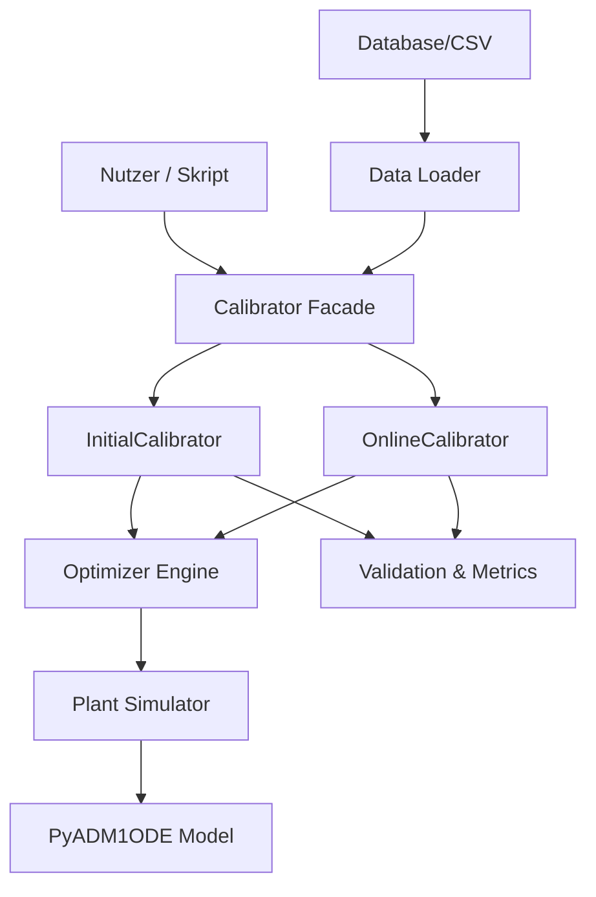
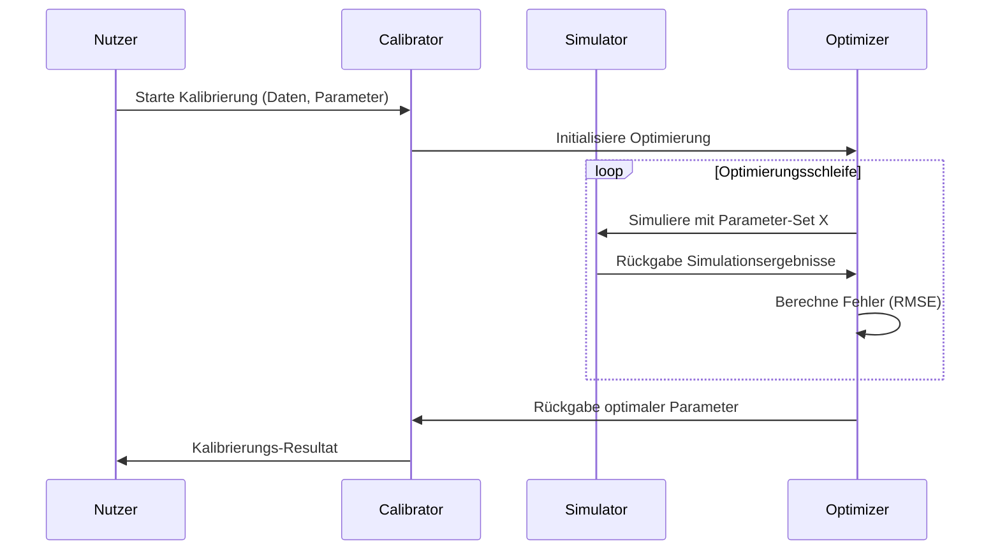

# Architektur

Diese Seite beschreibt die Systemarchitektur und den Datenfluss von PyADM1ODE_calibration.

## Systemübersicht

Das Framework ist modular aufgebaut, um Flexibilität bei der Wahl der Optimierungsalgorithmen und Datenquellen zu ermöglichen.

```mermaid
graph TD
    A[Nutzer / Skript] --> B[Calibrator Facade]
    B --> C[InitialCalibrator]
    B --> D[OnlineCalibrator]

    C --> E[Optimizer Engine]
    D --> E

    E --> F[Plant Simulator]
    F --> G[PyADM1ODE Model]

    H[Data Loader] --> B
    I[Database/CSV] --> H

    C --> J[Validation & Metrics]
    D --> J
```

## Datenfluss der Kalibrierung

Der typische Datenfluss während eines Kalibrierungszyklus:

```mermaid
sequenceDiagram
    participant U as Nutzer
    participant C as Calibrator
    participant S as Simulator
    participant O as Optimizer

    U->>C: Starte Kalibrierung (Daten, Parameter)
    C->>O: Initialisiere Optimierung
    loop Optimierungsschleife
        O->>S: Simuliere mit Parameter-Set X
        S->>O: Rückgabe Simulationsergebnisse
        O->>O: Berechne Fehler (RMSE)
    end
    O->>C: Rückgabe optimaler Parameter
    C->>U: Kalibrierungs-Resultat
```

## Komponenten-Beschreibung

- **Calibrator Facade**: Bietet eine einfache Schnittstelle für den Endanwender.  
- **Plant Simulator**: Kapselt die Logik zur Ausführung von PyADM1ODE Simulationen.  
- **Optimizer Engine**: Abstrakte Schicht für verschiedene Algorithmen (SciPy, eigene Implementierungen).  
- **Data Loader**: Validiert und transformiert Eingangsdaten in ein für den Simulator nutzbares Format.  
