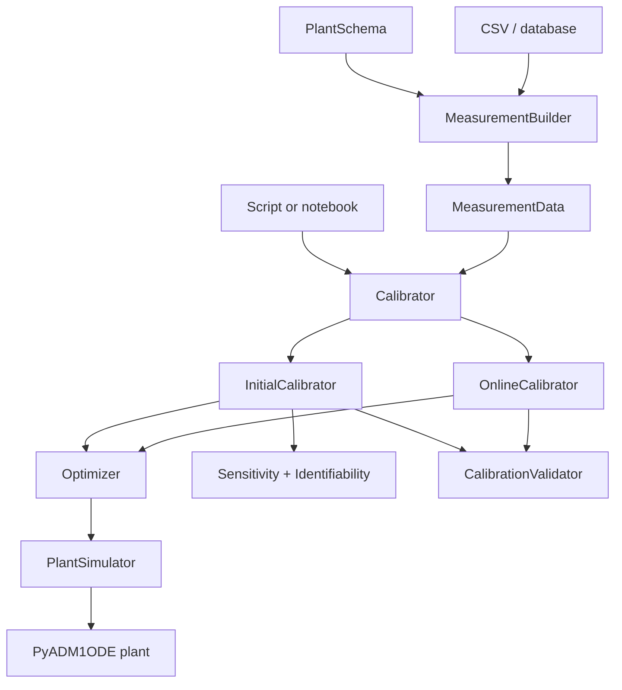
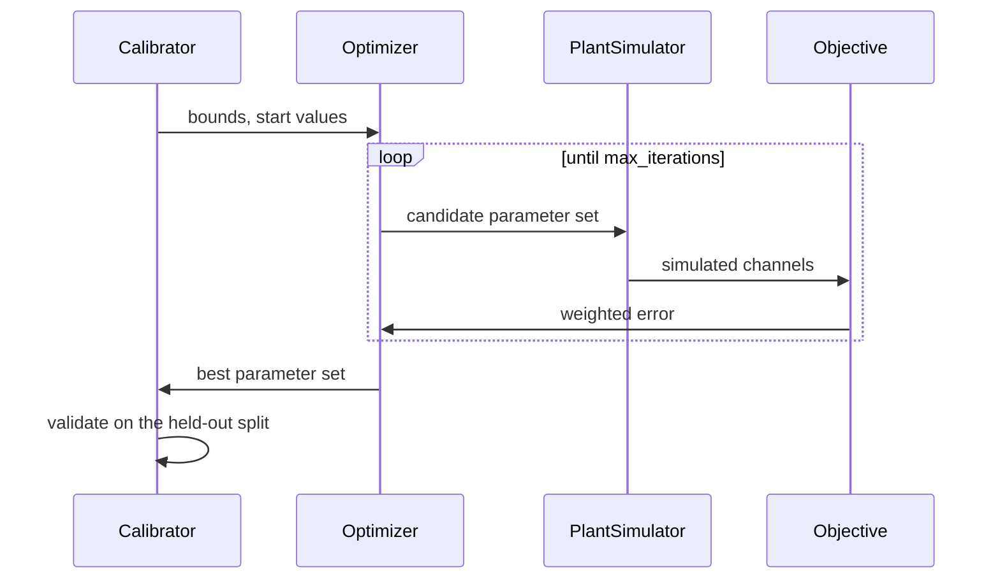

# Architektur

## Module

```mermaid
graph TD
    A[Script or notebook] --> B[Calibrator]
    B --> C[InitialCalibrator]
    B --> D[OnlineCalibrator]

    C --> E[Optimizer]
    D --> E
    E --> F[PlantSimulator]
    F --> G[PyADM1ODE plant]

    H[PlantSchema] --> I[MeasurementBuilder]
    I --> J[MeasurementData]
    K[CSV / database] --> I
    J --> B

    C --> L[Sensitivity + Identifiability]
    C --> M[CalibrationValidator]
    D --> M
```

`Calibrator` ist eine Fassade. Die beiden Kalibratoren darunter teilen sich einen `PlantSimulator`,
die einzige Stelle mit Kontakt zu PyADM1ODE, und eine Optimierer-Schnittstelle, die einzige Stelle
mit Kontakt zu SciPy. Daten erreichen sie als `MeasurementData`-Tabelle, gleich ob sie aus einer
CSV-Datei, einer Datenbank oder einem schemagesteuerten Builder stammen.

## Die Optimierungsschleife

```mermaid
sequenceDiagram
    participant C as Calibrator
    participant O as Optimizer
    participant S as PlantSimulator
    participant J as Objective

    C->>O: bounds, start values
    loop until max_iterations
        O->>S: candidate parameter set
        S->>J: simulated channels
        J->>O: weighted error
    end
    O->>C: best parameter set
    C->>C: validate on the held-out split
```

Eine Iteration ist eine vollständige Anlagensimulation über das Trainingsfenster. Deshalb bestimmt
die Zahl der Kandidaten die Laufzeit, nicht das Modell. Die Zielfunktion wandelt eine gescheiterte
Simulation in einen großen Fehler statt in eine Ausnahme, ein einzelner unlösbarer Kandidat kann
einen Lauf also nicht abbrechen.

## Wissenswerte Entwurfsentscheidungen

- **Parameter sind benannt, nicht positionsbezogen**, die Abbildung auf den Optimierervektor liegt an einer Stelle.  
- **Grenzen sind Daten**: `create_default_bounds()` führt Einheiten, Standardwerte und soft/hard für 41 Parameter.  
- **Anlagentopologien bleiben Python**, denn die PyADM1ODE-Anlagen-API ist ein Komponentengraph.  
- **Gespeicherte Zeitstempel sind naive UTC**, geschrieben über `timeutils.utc_now()`.  
