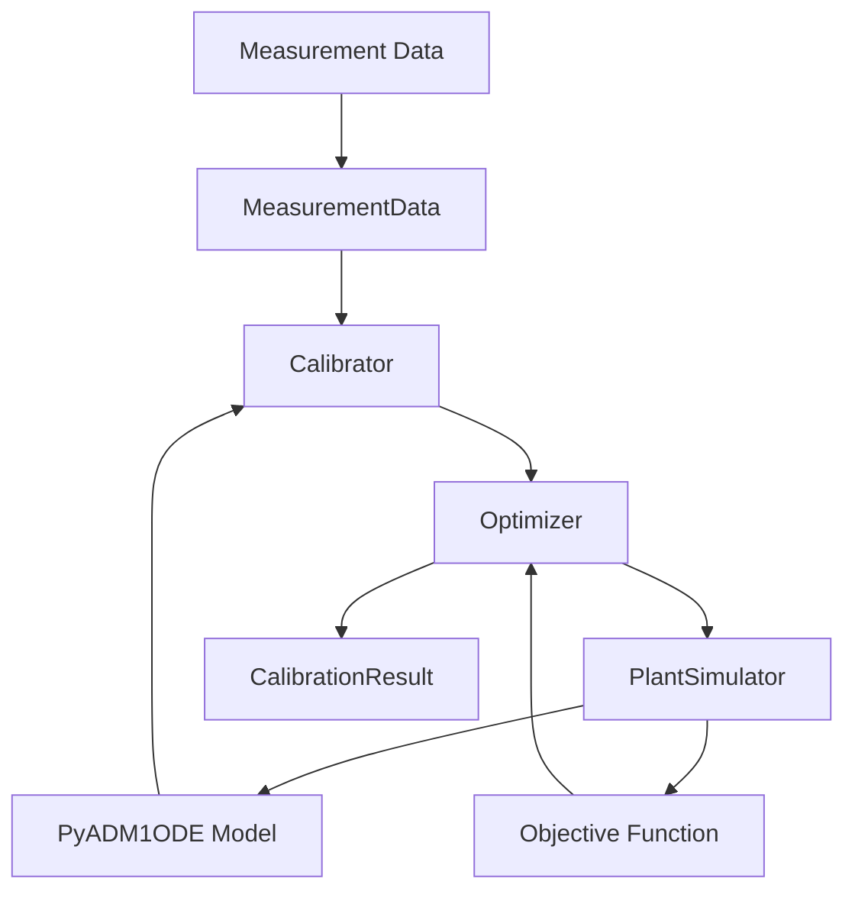

# Architecture

PyADM1ODE_calibration is built modularly to ensure flexibility in the choice of algorithms and data sources.

## System Overview

The following diagram shows the interaction between the main components:

## Data Flow

1. **Input**: Measurement data is read via `io.loaders`.
2. **Validation**: `io.validation` checks data quality.
3. **Optimization**: The `Calibrator` orchestrates the `Optimizer` to find parameters that minimize the error between simulation and measurement.
4. **Output**: Results are returned as `CalibrationResult` and optionally stored in the database.

## Class Hierarchy

- **BaseCalibrator**: Abstract base class.
- **InitialCalibrator**: Implementation for batch processes.
- **OnlineCalibrator**: Implementation for real-time adjustments.
