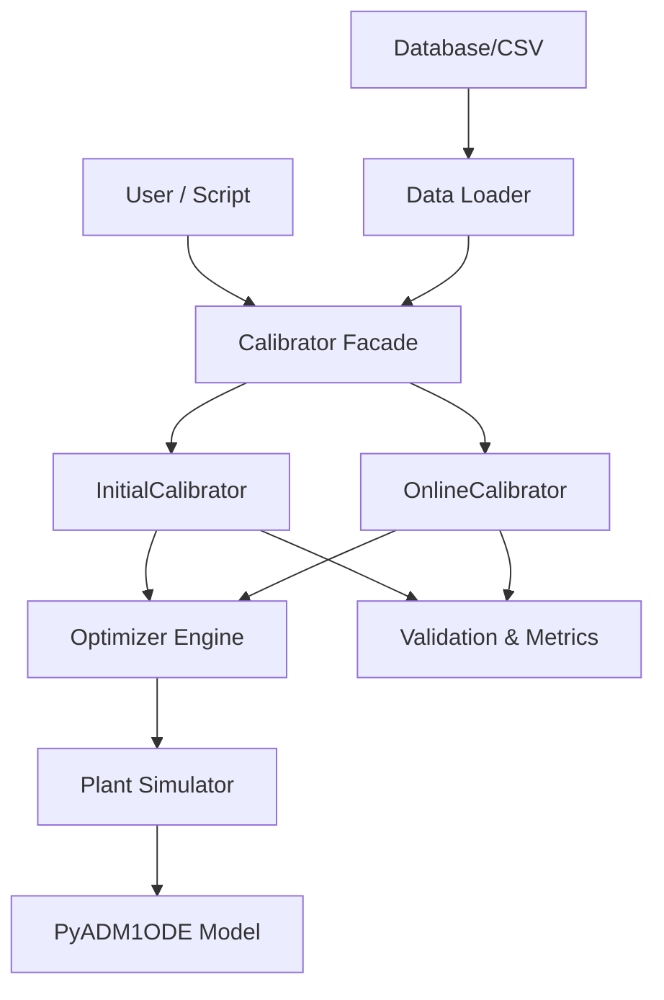
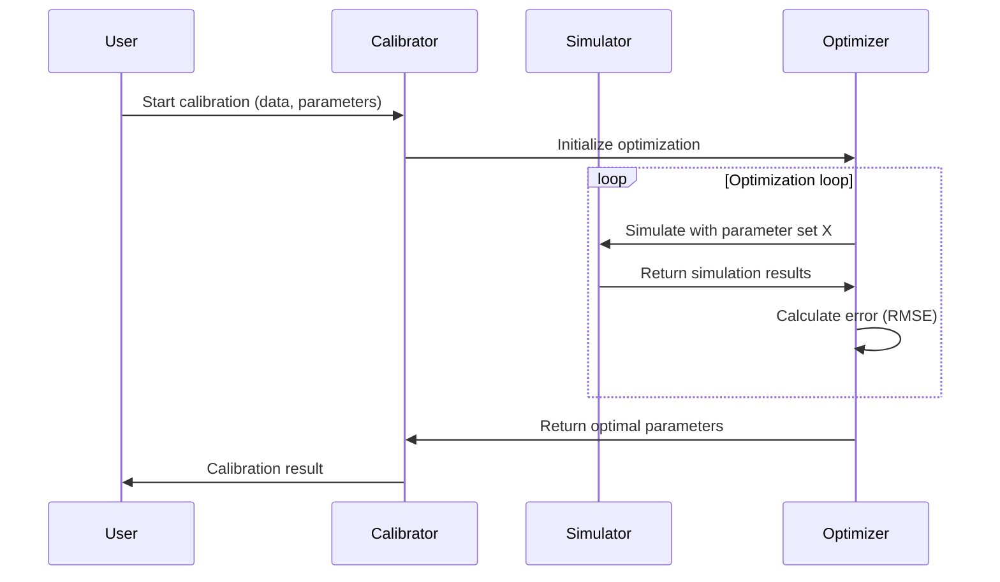

# Architecture

This page describes the system architecture and data flow of PyADM1ODE_calibration.

## System Overview

The framework is modularly structured to allow flexibility in the choice of optimization algorithms and data sources.

```mermaid
graph TD
    A[User / Script] --> B[Calibrator Facade]
    B --> C[InitialCalibrator]
    B --> D[OnlineCalibrator]

    C --> E[Optimizer Engine]
    D --> E

    E --> F[Plant Simulator]
    F --> G[PyADM1ODE Model]

    H[Data Loader] --> B
    I[Database/CSV] --> H

    C --> J[Validation & Metrics]
    D --> J
```

## Calibration Data Flow

The typical data flow during a calibration cycle:

```mermaid
sequenceDiagram
    participant U as User
    participant C as Calibrator
    participant S as Simulator
    participant O as Optimizer

    U->>C: Start calibration (data, parameters)
    C->>O: Initialize optimization
    loop Optimization loop
        O->>S: Simulate with parameter set X
        S->>O: Return simulation results
        O->>O: Calculate error (RMSE)
    end
    O->>C: Return optimal parameters
    C->>U: Calibration result
```

## Component Description

- **Calibrator Facade**: Provides a simple interface for the end user.
- **Plant Simulator**: Encapsulates the logic for executing PyADM1ODE simulations.
- **Optimizer Engine**: Abstract layer for various algorithms (SciPy, custom implementations).
- **Data Loader**: Validates and transforms input data into a format usable by the simulator.
