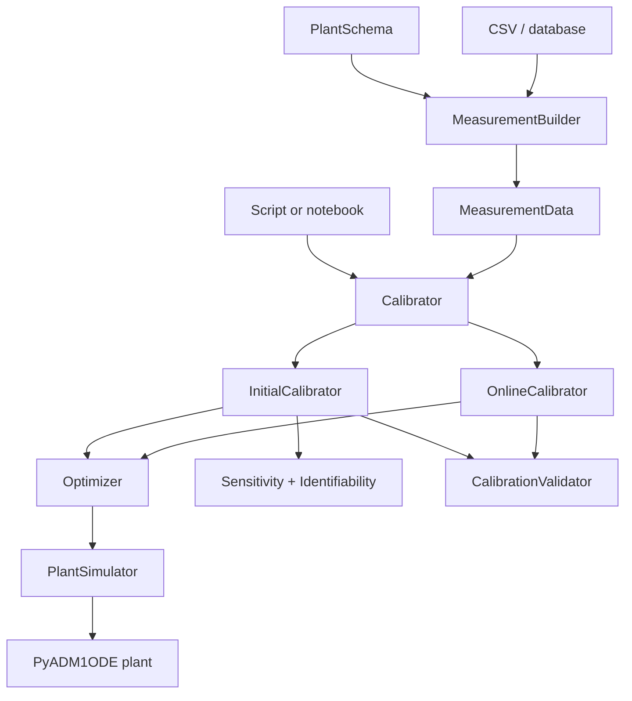
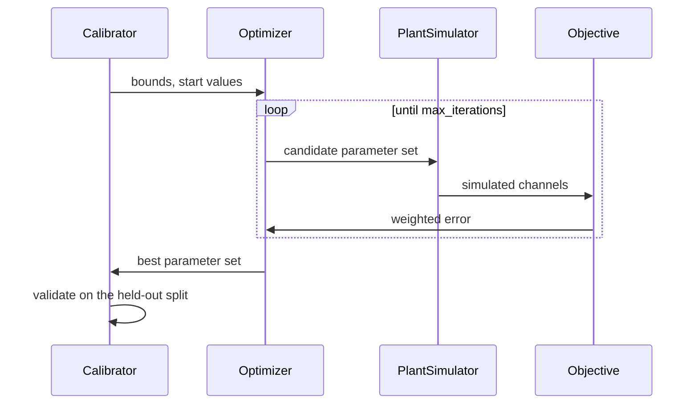

# Architecture

## Modules

```mermaid
graph TD
    A[Script or notebook] --> B[Calibrator]
    B --> C[InitialCalibrator]
    B --> D[OnlineCalibrator]

    C --> E[Optimizer]
    D --> E
    E --> F[PlantSimulator]
    F --> G[PyADM1ODE plant]

    H[PlantSchema] --> I[MeasurementBuilder]
    I --> J[MeasurementData]
    K[CSV / database] --> I
    J --> B

    C --> L[Sensitivity + Identifiability]
    C --> M[CalibrationValidator]
    D --> M
```

`Calibrator` is a facade. The two calibrators below it share one `PlantSimulator`, which is the only
place that talks to PyADM1ODE, and one optimizer interface, which is the only place that talks to
SciPy. Data reaches them as a `MeasurementData` frame, no matter whether it came from a CSV, a
database or a schema-driven builder.

## The optimization loop

```mermaid
sequenceDiagram
    participant C as Calibrator
    participant O as Optimizer
    participant S as PlantSimulator
    participant J as Objective

    C->>O: bounds, start values
    loop until max_iterations
        O->>S: candidate parameter set
        S->>J: simulated channels
        J->>O: weighted error
    end
    O->>C: best parameter set
    C->>C: validate on the held-out split
```

One iteration is one full plant simulation over the training window, which is why the run time is
set by the number of candidates rather than by the model. The objective converts a failed simulation
into a large error instead of an exception, so a single unsolvable candidate cannot abort a run.

## Design decisions worth knowing

- **Parameters are named, not positional**, so the mapping to the optimizer's vector lives in one place.
- **Bounds are data**: `create_default_bounds()` carries units, defaults and a soft/hard flag for 41 parameters.
- **Plant topologies stay Python**, because the PyADM1ODE plant API is a component graph.
- **Stored timestamps are naive UTC**, written through `timeutils.utc_now()`.
